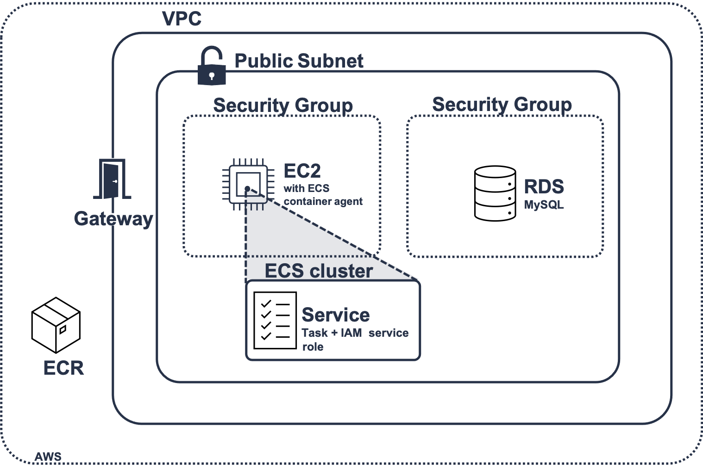

# Wordpress container on an ECS cluster

## Procedure to solve the problem:
1. Read the documentation about Terraform & Packer & AWS ECS/RDS (since I never worked before with these technologies):
2. Start by testing the docker wordpress locally and test the installation of ansible on it
3. Create packerfile to **make a new version of wordpress with ansible installed**
    1. Install ansible via bash script, run a simple ansible playbook on the container and then tag the docker image and push it to a repo (for now just tag and not pushed to a remote repo)
4. Push the created image in amazon to a **ECR created with terraform**
    1. Install aws cli and configure using aws configure to create file in ~/.aws/credentials use eu-west-3 region (Paris)
    2. Create the terraform file to create ECR and then relaunch packer to push the image into it
    3. Implement a .gitignore to avoid pushing unnecessary terraform files and a Makefile to make easier to test 
5. Create a project simple architecture using terraform: **ECS cluster running inside single EC2 using RDS**
    1. Define the VPC as well and 1 public subnet with a route table that routes all traffic to a internet gateway
    2. Create 2 security groups, one for the EC2 instance another for the RDS to control inbound and outbound traffic
    3. Crean an [IAM service role](https://docs.aws.amazon.com/AmazonECS/latest/developerguide/instance_IAM_role.html) to give permission to the ECS agent running in the EC2
    4. Define the EC2 instance using amazon-ecs-optimized ami and configure the ecs-agent to use the rigth cluster name 
    5. Define the RDS database
    6. Define the ecs cluster, service and task definition to run the wordpress image as specified


## Architecture implemented:



## How to use:

1. Create your [aws account](https://console.aws.amazon.com/iam/home?#security_credential) and install aws-cli. Set local aws profile using:
```
    aws configure
```
2. Create the terraform ECR:
```
    make ecr
```
3. Export the outputs of the terraform as env variables (TF_VAR required to be detected by terraform in point 5):
```makefile
    export TF_VAR_ecr_url=$(cd terraform/ecr; terraform output url_ecr | tr -d '"')
    export ECR_REGISTRY_ID=$(cd terraform/ecr; terraform output registry_id_ecr | tr -d '"')
```
4. Create, tag and push new image version of wordpress_docker into created ECR:
```makefile
    make new-wordpress-image
```
5. Create the remaining aws architecture, to run the container in ECS using RDS:
```makefile
    make aws-architecture
```
6. Finally, to clean the resources all created resources in AWS use: (May fail due to timeout and require manual cleaning)
```makefile
    make clean_all_resources
```


## Improvements:
The solution implemented is not ready for production as the bug in the RDS showed. 

So as next steps implement ec2 scalabity, then create a load balancer to manage the inputs in the public subnet.
Create different Availability zones for achiving HA.

Also test implementation with fargate (not manage EC2)

For production in terms of security I would limit the inboud traffic to a set of IP ranges instead of accepting all the traffic as it is now.

I would also implement monitoring/logging with a set of metrics and alerts maybe with Graphana/Prometheus.

And finally Create Pipeline to have different cluster environments (prod,test,...) with different specifications. I tried to already create as much variables as possible to allow for customisation 


## Problem Log:

**14 March** - At first, it was a challenge to understand the packer file syntax but I managed to catch up quickly with the bugs. I also lost a bit of time trying to understand if I could change the default entrypoint after the docker builder since by default it is --entrypoint=/bin/sh which is different from the original in the Dockerfile of wordpress.

**16 March** - Some problems with how to connect to aws (via profile or credentials ). Also had some problems trying to understand if i could automatise the export of the env variables 

**18 March** - It was quite hard to learn about all the different AWS resources as I went and implement at the same time an archicture.Also because i was trying to keep the archicture minimalist I had a bug in the RDS because it required 2 subnets with 2 AV and that's why I had a "quick-non-production-ready" fix to create another subnet just to be able to test the rest of the implementation. 

**19 March** - Finally faced some problems with how to connect to the instance

